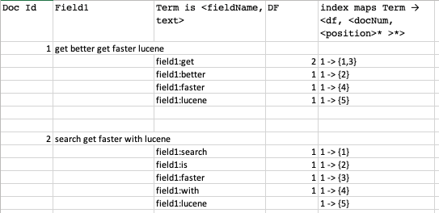
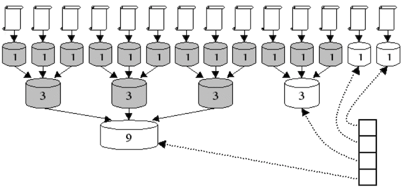
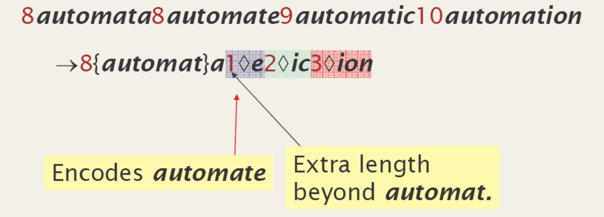
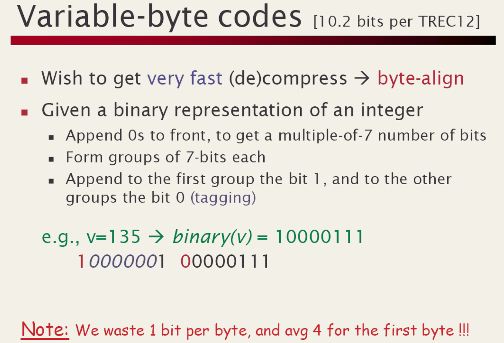
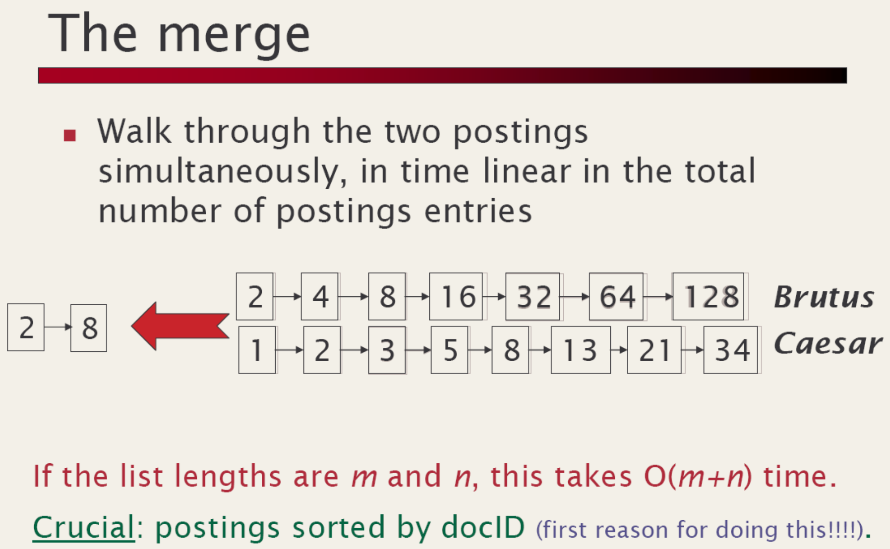
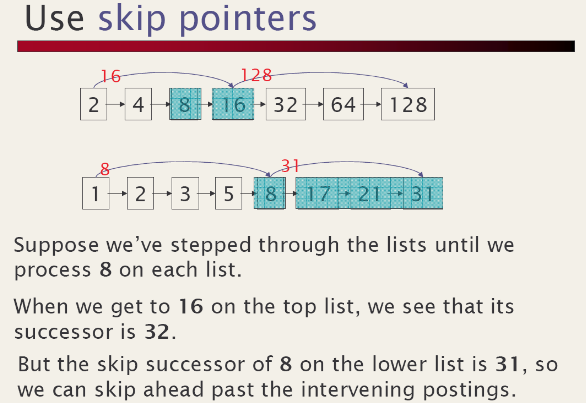
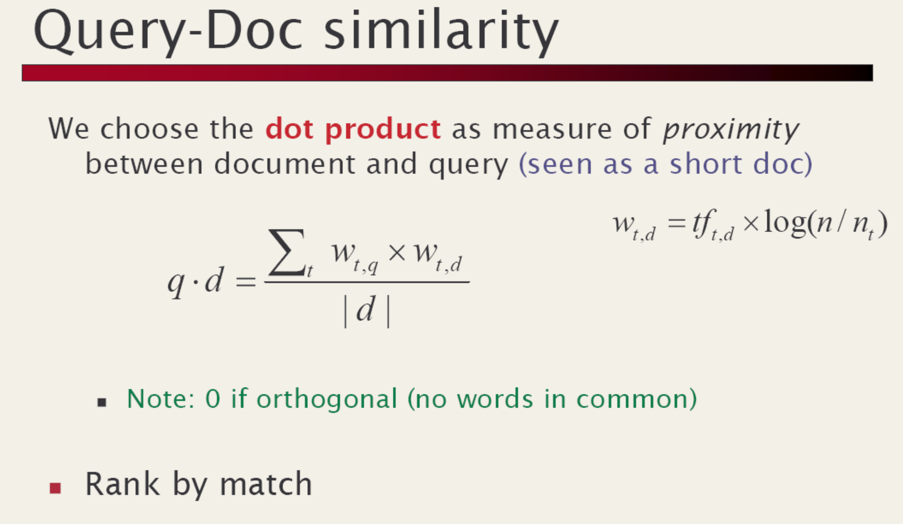

# Lucene - quick look inside  

!!! Sources
    - [http://lucene.sourceforge.net/talks/pisa/](http://lucene.sourceforge.net/talks/pisa/)
    - [https://www.baeldung.com/lucene](https://www.baeldung.com/lucene)

## Main points

### Writing documents

- Index is represented by `Directory` object. Could be on file, in memory, database etc
- `IndexWriter` writes documents into index. `IndexWriterConfig` provides writer configuration. 
- `Analyzer` is a very important part of configuration, both for writing and reading. See [http://localhost:63342/code-snippets/lucene-core-7.4.0-javadoc.jar/org/apache/lucene/analysis/Analyzer.html](http://localhost:63342/code-snippets/lucene-core-7.4.0-javadoc.jar/org/apache/lucene/analysis/Analyzer.html)
- [Documents](http://localhost:63342/code-snippets/lucene-core-7.4.0-javadoc.jar/org/apache/lucene/document/Document.html) are the unit of indexing and search. A Document is a set of [fields](http://localhost:63342/code-snippets/lucene-core-7.4.0-javadoc.jar/org/apache/lucene/document/Field.html). Each field has a name and a textual value.  

### Searching documents

- [IndexReader](http://localhost:63342/code-snippets/lucene-core-7.4.0-javadoc.jar/org/apache/lucene/index/IndexReader.html) provides an interface for accessing a point-in-time view of an index.
- [IndexSearcher](http://localhost:63342/code-snippets/lucene-core-7.4.0-javadoc.jar/org/apache/lucene/search/IndexSearcher.html) implements search over a single IndexReader. 
- To search an index:
    - Instantiate [QueryParser](http://localhost:63342/code-snippets/lucene-queryparser-7.4.0-javadoc.jar/org/apache/lucene/queryparser/classic/QueryParser.html). This object can be reused multiple times for various queries. When creating QueryParser provide an [analyzer](http://localhost:63342/code-snippets/lucene-core-7.4.0-javadoc.jar/org/apache/lucene/analysis/Analyzer.html) similar to how we did for writing an index 
    - Create a [Query](http://localhost:63342/code-snippets/lucene-core-7.4.0-javadoc.jar/org/apache/lucene/search/Query.html) using [QueryParser](http://localhost:63342/code-snippets/lucene-queryparser-7.4.0-javadoc.jar/org/apache/lucene/queryparser/classic/QueryParser.html) represented by  for using with query
    - Submit query instance to `indexSearcher.search()` and process results. 

## Lucene API
- org.apache.lucene.document
- org.apache.lucene.analysis
- org.apache.lucene.index
- org.apache.lucene.search

### Package: org.apache.lucene.document
- A Document is a sequence of Fields.
- A Field is a _<name, value>_ pair.
    - _name_ is the name of the field, e.g., title, body, subject, date, etc. 
    - _value_ is text.
- Field values may be stored, indexed or analyzed (and, now, vectored).

!!! Example
    ```java
    Document makeDocument(String title, String body) {
        Document doc = new Document();
        doc.add(new TextField("title", title, Field.Store.YES));
        doc.add(new TextField("body", body, Field.Store.YES));
        return doc;
    }
    ```
  
### Package: org.apache.lucene.analysis

- An **Analyzer** is a **TokenStream** factory.
- A **TokenStream** is an iterator over Tokens.
    - input is a character iterator (Reader)
- A __Token__ is tuple _<text, type, start, length, positionIncrement>_
    - __text__ (e.g., “pisa”).
    - __type__ (e.g., “word”, “sent”, “para”).
    - __start__ & length offsets, in characters (e.g, <5,4>)
    - __positionIncrement__ (normally 1)
- standard __TokenStream__ implementations are
    - __Tokenizers__, which divide characters into tokens and 
    - __TokenFilters__, e.g., stop lists, stemmers, etc.

!!! Example
    ```java
    public class ItalianAnalyzer extends Analyzer {
      private Set stopWords = 
        StopFilter.makeStopSet(new String[] {"il", "la", "in"};
    
      public TokenStream tokenStream(String fieldName, Reader reader) {
        TokenStream result = new WhitespaceTokenizer(reader);
        result = new LowerCaseFilter(result);
        result = new StopFilter(result, stopWords);
        result = new SnowballFilter(result, "Italian");
        return result;
     }
    }
    ```

## Package: org.apache.lucene.index

- __Term__ is `<fieldName, text>`
- Index maps `Term → <df, <docNum, <position>* >*>` <br/>
  e.g. `“content:pisa” → <2, <2, <14>>, <4, <2, 9>>>`
- Term vectors
- Example



!!! Example
    ```java
    IndexWriter writer = new IndexWriter("index", new ItalianAnalyzer());
    File[] files = directory.listFiles();
    for (int i = 0; i < files.length; i++) {
      writer.addDocument(makeDocument(files[i]));
    }
    writer.close();
    ```

### Some Inverted Index Strategies

| Strategy                                | Pro   | Cons  |
| --------------------------------------- | ----- | ----- |
| Batch-based: use file-sorting algorithms (textbook) | - fastest to build <br/> - fastest to search| slow to update  |              
| B-tree based: update in place <br/> [http://lucene.sf.net/papers/sigir90.ps](http://lucene.sf.net/papers/sigir90.ps)          | fast to search | - update/build does not scale <br/> - complex implementation |                                               
| Segment based: lots of small indexes    | - fast to build <br/> - fast to update | slower to search |                                         

### Lucene's Index Algorithm

- two basic algorithms
    1. make an index for a single document
    2. merge a set of indices
- incremental algorithm:
    - maintain a stack of segment indices
    - create index for each incoming document
    - push new indexes onto the stack
    - let b=10 be the merge factor; M=∞; 

!!! Example
    ```java
    for (size = 1; size < M; size *= b) {
      if (there are b indexes with size docs on top of the stack) {
       pop them off the stack;
       merge them into a single index;
       push the merged index onto the stack;
     } else {
       break;
     }
    }
    ```
        
    !!! todo
        Need to check/elaborate
        
- optimization: single-doc indexes kept in RAM, saves system calls

!!! note
    - average `b*logb(N)/2` indexes
        - N=1M, b=2 gives just 20 indexes
        - fast to update and not too slow to search
    - batch indexing  w/ M=∞, merge all at end
        - equivalent to external merge sort, optimal
    - segment indexing w/ M<∞

### Indexing Diagram

- b = 3
- 11 documents indexed
- stack has four indexes
- grayed indexes have been deleted
- 5 merges have occurred



### Index Compression

For keys in `Term -> ... map`, use technique from [Paolo's slides](http://roquefort.di.unipi.it/~ferrax/Teach/InformationRetrieval.html):

__4th solution: front coding__

Idea: sorted words commonly have long common prefix - stored diffrences only wrt the first term in a block og k
 


For values in Term -> ... map, use technique from [Paolo's slides](http://roquefort.di.unipi.it/~ferrax/Teach/InformationRetrieval.html):



VInt Encoding Example

| Value | First byte | Second byte | Third byte
|-------|------------|-------------|------------
|0      | 00000000   |
|1      | 00000001
|2      | 00000010
|...
|127    |01111111
|128    |10000000   |00000001
|129    |10000001   |00000001
|130    |10000010   |00000001
|...
|16,383 |11111111   |01111111|
|16,384 |10000000   |10000000|00000001
|16,385 |10000001   |10000000|00000001
|...

This provides compression while still being efficient to decode.

## Package: `org.apache.lucene.search`

- primitive queries:
    - **TermQuery**: match docs containing a Term
    - **PhraseQuery**: match docs w/ sequence of Terms
    - **BooleanQuery**: match docs matching other queries.<br/>
      e.g., `+path:pisa +content:“Doug Cutting” -path:nutch`
    - new: **SpansQuery**
    - derived queries:
        - **PrefixQuery**, **WildcardQuery**, etc.

!!! Example
    
    ```java    
    Query pisa = new TermQuery(new Term("content", "pisa"));
    Query babel = new TermQuery(new Term("content", "babel"));
    
    PhraseQuery leaningTower = new PhraseQuery();
    leaningTower.add(new Term("content", "leaning"));
    leaningTower.add(new Term("content", "tower"));
    
    BooleanQuery query = new BooleanQuery();
    query.add(leaningTower, Occur.MUST);
    query.add(pisa, Occur.SHOULD);
    query.add(babel, Occur.MUST_NOT);
    ```

### Search algorithms

From [Paolo's slides](http://roquefort.di.unipi.it/~ferrax/Teach/InformationRetrieval.html):



### Lucene's Disjunctive Search Algorithm
- described in http://lucene.sf.net/papers/riao97.ps
- since all postings must be processed
    - goal is to minimize per-posting computation
- merges postings through a fixed-size array of accumulator buckets
- performs boolean logic with bit masks
- scales well with large queries

!!! todo 
    draw a diagram to illustrate?

### Lucene's Conjunctive Search Algorithm

From Paolo's slides:


Algorithm
- use linked list of pointers to doc list
- initially sorted by doc
- loop
    - if all are at same doc, record hit
    - skip first to-or-past last and move to end of list


### Scoring
From Paolo's slides:



- Is very much like [Lucene's Similarity](https://lucene.apache.org/core/7_5_0/core/org/apache/lucene/search/similarities/Similarity.html)

### Lucene's Phrase Scoring
- approximate phrase IDF with sum of terms
- compute actual tf of phrase
- slop penalizes slight mismatches by edit-distance
